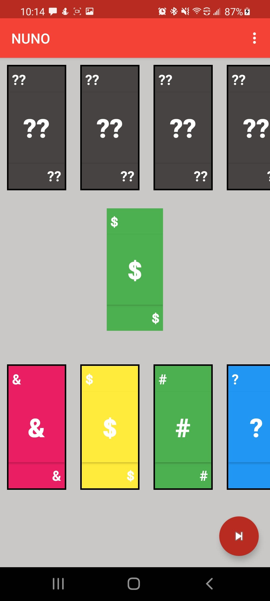

# NUNO (Not UNO)

This is a simple game that is loosely base on UNO. Instead of using numbers
it uses symbols. It also lets you create your own special cards with bizzre rules.

**Features**
- Play 1 v 1 in person
- Play 1 v 1 against computer  
 

**Skills Learned**
- Basic XML to Java objects 
- Object-oriented Java 
- Simple Game logic 

# Screenshots
 -----------
 

